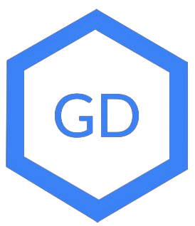
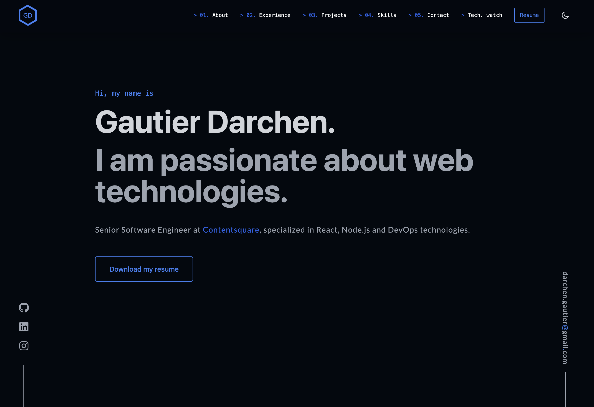

<div align="center">
  
</div>
<h1 align="center">
  <a href="https://gautier-darchen.vercel.app/">gautier-darchen.vercel.app</a>
</h1>
<p align="center">
  Source of my website <a href="https://gautier-darchen.vercel.app/" target="_blank">gautier-darchen.vercel.app</a> built with <a href="https://nextjs.org/" target="_blank">Nextjs</a> and hosted with <a href="https://vercel.com/" target="_blank">Vercel</a>
</p>

<!-- TODO: pnpm, ci checks, protect branch, pr-template, commitlint/precommit hooks -->


<!-- [](https://github.com/gdarchen/portfolio)
[](https://yarnpkg.com/)
[](https://nodejs.org/en/)
 -->

## 

## 👋 About this repo

This is the 3rd version of my personal website.

I rewrote it completely here using Next, Tailwind and FramerMotion.

## 👨‍💻 Contributing

Here is how to setup the project locally to contribute:

1. Clone the repository:
   ```bash
   $ git clone git@github.com:gdarchen/portfolio.git
   ```
   <!-- TODO: improve when yarn@4 or pnpm -->
2. Install the dependencies using `yarn` as follows: TODO
   ```bash
   $ yarn install
   ```
3. Run the application locally:
   ```bash
   $ yarn dev
   ```

---


## 📦 Deploy

To deploy a new version, simply open a pull request again the `main` branch.

When this pull request will be merged, a new version will be deployed in production automatically.

---

## 📣 Author Info

- Linkedin - [@gautierdarchen](https://www.linkedin.com/in/gautierdarchen/)
- Website - [Gautier Darchen](https://gautier-darchen.vercel.app/)
